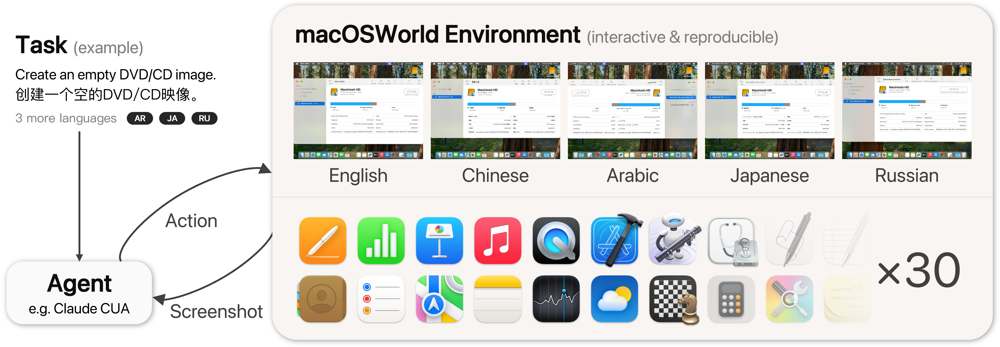
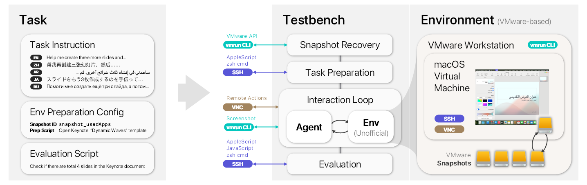

<div align="center">
<h1>macOSWorld: A Multilingual Interactive Benchmark for GUI Agents</h1>
</div>

<div align="center">
    <a href="https://scholar.google.com/citations?user=eBvav_0AAAAJ&hl=en">Pei Yang</a><sup>&#42;</sup>&nbsp;, <a href="https://scholar.google.com/citations?user=GMrjppAAAAAJ&hl=en">Hai Ci</a><sup>&#42;</sup>&nbsp;, and <a href="https://sites.google.com/view/showlab">Mike Zheng Shou</a><sup>&#x2709</sup>

</div>

<div align="center">
    <a href='https://sites.google.com/view/showlab/home?authuser=0' target='_blank'>Show Lab</a>, National University of Singapore
    <p>
</div>

<div align="center">
    <a href="https://arxiv.org/abs/2506.04135">
        
    </a>
    &nbsp;
    <a href="https://macos-world.github.io">
        
    </a>
    &nbsp;
    
    &nbsp;
    
    <p>
</div>




<br/>

## 🆕 Updates
 - **[10 Apr 2026]** Added Lume implementation for Apple Silicon Macs (clone-based environment reset)
 - **[18 Sep 2025]** macOSWorld accepted to NeurIPS 2025
 - **[15 Sep 2025]** Optimised the automated benchmark execution experience; Added a GUI display for real-time benchmark progress and results

<br/>

## ❗ Important Notes

### 👍 Two Implementations

This fork supports **two VM backends**:

| | VMware Implementation | Lume Implementation |
|---|---|---|
| **Platform** | Windows / Linux (Intel/AMD with AVX2) | macOS (Apple Silicon) |
| **Virtualisation** | VMware Workstation | Apple Virtualization.framework via [Lume](https://cua.ai/docs/lume/guide/getting-started/introduction) |
| **Env Reset** | Snapshot revert | APFS clone (copy-on-write) |
| **Reset Time** | ~1 min | ~40 s (clone + boot + setup) |
| **Display** | VMware VNC via SSH tunnel | Direct VNC (Retina 2x auto-scaled) |
| **iMovie Tasks** | Not supported | Not supported |

### ⚠️ Requirements -- VMware (Windows / Linux)

 - Minimum hardware requirements: 
     - Windows / Linux machines with Intel/AMD CPUs supporting AVX2 ([Check CPU AVX2 support](https://avx2checker.com/))
     - 32 GB of RAM
     - 400 GB of free disk space

### ⚠️ Requirements -- Lume (Apple Silicon)

 - Apple Silicon Mac (M1/M2/M3/M4 series)
 - macOS Sequoia 15.0+ (Tahoe)
 - [Lume CLI](https://cua.ai/docs/lume/guide/getting-started/installation) v0.3.9+
 - 32 GB of RAM recommended
 - 200 GB of free disk space
 - A prepared golden VM (see [Step 2, Option A](#option-a-lume--macos-with-apple-silicon-recommended))

### Supported Task Categories

 This implementation cannot cover benchmarking for iMovie-related tasks. Referring to Table 3 (main results) in the macOSWorld paper, it can support reporting the following metrics:

<!-- <span style="color:lime">✔</span>
<span style="color:red">✘</span> -->

| **Category**       | **Supported** |
|--------------------|---------------|
| System & Interface | ✔️ |
| System Apps        | ✔️ |
| File Management    | ✔️ |
| Productivity       | ✔️ |
| Media              | ✔️ |
| Advanced Apps*     | ⭕ |
| Multi-Apps         | ✔️ |
| Overall            | ✔️ |
*This VMware implementation excludes iMovie tasks.

<br/>
<br/>
<br/>

## ⭐ Features of macOSWorld
 - **Interactive macOS environment:** 30 macOS-native apps with their exclusive user interfaces
 - **Multilingual benchmarking:** Tasks and environments available in English, Chinese, Arabic, Japanese and Russian
 - **Safety evaluation:** Dedicated subset for benchmarking agents' resilience under context deception attacks

<br/>

## 🚀 Getting Started



This implementation consists of a Python testbench script and a VM-based macOS environment (VMware or Lume). Both run locally, despite the testbench may require access to online APIs. The benchmark process involves four main steps:

 - **[Step 1: Environment Setup](#step-1-environment-setup)**
     - [1.1. Install Dependencies](#11-install-dependencies)  
     - [1.2. Model-Specific Configurations](#12-model-specific-configurations)  
 - **[Step 2: VM Environment Setup](#step-2-vm-environment-setup)** *(choose one)*
     - [Option A: Lume — macOS with Apple Silicon (Recommended)](#option-a-lume--macos-with-apple-silicon-recommended)
     - [Option B: VMware — Windows / Linux with Intel/AMD](#option-b-vmware--windows--linux-with-intelamd)
 - **[Step 3: Running the Benchmark](#step-3-running-the-benchmark)**  
     - [3.1. Execute Benchmark (VMware)](#31-execute-benchmark-vmware)
     - [3.2. Execute Benchmark (Lume)](#32-execute-benchmark-lume)
     - [3.3. Run Testbench Manually](#33-run-testbench-manually)
     - [3.4. Manually Handle Interruptions](#34-manually-handle-interruptions)
     - [3.5. Monitor Progress and Aggregate Results](#35-monitor-progress-and-aggregate-results)
 - **[Step 4: Releasing Resources](#step-4-releasing-resources)**

<br/>

### Step 1: Environment Setup

#### 1.1. Install Dependencies

```bash
uv venv .venv
source .venv/bin/activate
uv pip install -r requirements.txt
```

#### 1.2. Model-Specific Configurations

**For GPT-4o with SoM Annotations:**

1. Install additional dependencies:
```bash
conda activate macosworld
pip install timm easyocr paddlepaddle paddleocr einops==0.8.0 supervision==0.18.0 ultralytics==8.3.70
```

2. Download model weights:
```bash
mkdir OmniParser
cd OmniParser
git clone https://huggingface.co/microsoft/OmniParser-v2.0
mv OmniParser-v2.0 weights
mv weights/icon_caption weights/icon_caption_florence
```

**For Gemini Models:**

macOSWorld uses the VertexAI API. Follow [this guide](https://www.youtube.com/watch?v=I8W-4oq1onY) to set up credentials and obtain a JSON credential file. Set the environment variable:

```bash
export GOOGLE_APPLICATION_CREDENTIALS='/path/to/gen-lang-client-xxx.json'
```

**For ShowUI:**

```bash
conda activate macosworld
pip install torch==2.6.0 qwen-vl-utils transformers==4.47.0 accelerate==0.26.0
```

**For UI-TARS:**

1. Install dependencies:
```bash
conda create -n uitars python=3.9.21
pip install -U transformers==4.49.0  
pip install vllm==0.6.6 --extra-index-url https://download.pytorch.org/whl/cu124
```

2. Start the vLLM service on the same device running the testbench:
```bash
NCCL_P2P_DISABLE=1 CUDA_VISIBLE_DEVICES=0,1,2,3 vllm serve "bytedance-research/UI-TARS-7B-DPO" --served-model-name UI-TARS-7B-DPO --limit-mm-per-prompt image=3 -tp 4
```

> **Note**: The `tp` parameter specifies the number of GPUs to use and must be a common divisor of 28 and 16.

<br/>

### Step 2: VM Environment Setup

> Choose **one** backend based on your platform.

#### Option A: Lume — macOS with Apple Silicon (Recommended)

**A.1. Install Lume**

```bash
# Install Lume CLI (v0.3.9+)
/bin/bash -c "$(curl -fsSL https://raw.githubusercontent.com/trycua/cua/main/libs/lume/scripts/install.sh)"

# Verify installation
lume --version
```

**A.2. Pull a Golden VM**

Golden VMs are pre-configured macOS images that serve as the template for all benchmark tasks. Two macOS versions are available:

| Golden VM | macOS Version | GHCR Package |
|-----------|---------------|--------------|
| `macos-tahoe-cua` | macOS 26 (Tahoe) | [ghcr.io/erythrinavariegata/macos-tahoe-cua](https://github.com/users/ErythrinaVariegata/packages/container/package/macos-tahoe-cua) |
| `macos-sequoia-cua-sparse` | macOS 15 (Sequoia) | [ghcr.io/erythrinavariegata/macos-sequoia-cua-sparse](https://github.com/users/ErythrinaVariegata/packages/container/package/macos-sequoia-cua-sparse) |

Each image ships with language-specific tags (e.g. `macosworld-en`, `macosworld-zh`).

```bash
# Pull a Tahoe golden VM (macOS 26)
lume pull macos-tahoe-cua:macosworld-en --registry ghcr.io --organization erythrinavariegata
lume pull macos-tahoe-cua:macosworld-zh --registry ghcr.io --organization erythrinavariegata

# Pull a Sequoia golden VM (macOS 15)
lume pull macos-sequoia-cua-sparse:macosworld-en --registry ghcr.io --organization erythrinavariegata
lume pull macos-sequoia-cua-sparse:macosworld-zh --registry ghcr.io --organization erythrinavariegata
```

After pulling, verify:
```bash
lume ls    # should show the pulled VM(s) in "stopped" state
```

> **Note:** The golden VM naming convention after pull is `<image>_<tag>`, e.g. `macos-tahoe-cua_macosworld-en`. This is the name you pass to `--lume_golden_vm`.

**A.3. Grant TCC Permissions (Critical)**

macOS requires explicit TCC (Transparency, Consent, and Control) permissions for SSH-based osascript access. **Without this step, grading commands will hang indefinitely.**

```bash
# Start the golden VM
lume run macos-tahoe-cua_macosworld-en --no-display &

# Wait for boot (~20s), then run the preparation script
./scripts/prepare_golden_vm.sh macos-tahoe-cua_macosworld-en

# Stop the golden VM to save the permissions
lume stop macos-tahoe-cua_macosworld-en
```

The script triggers osascript commands that produce TCC permission dialogs. For each dialog, connect to the VM via VNC (Screen Sharing) and click **"Allow"**. Alternatively, use the keyboard shortcut **Tab + Space** to approve.

Apps that need TCC permission: Contacts, Reminders, Notes, Music, Keynote, Numbers, Pages, Script Editor, Finder, System Events, Calendar, Automator, Xcode, QuickTime Player.

> **Tip:** After granting permissions once on the golden VM, all cloned VMs inherit them automatically. The testbench also includes an auto-grant fallback that uses VNC keyboard automation (Tab + Space) if any permissions are missing.

**A.4. Configure Golden VM Mapping (Optional)**

The default `constants.py` already maps snapshot names to the pre-built golden VMs:

```python
lume_snapshot_lookup = {
    'snapshot_used_en': 'macos-tahoe-cua_macosworld-en',
    'snapshot_used_zh': 'macos-tahoe-cua_macosworld-zh',
    # Add other language/version VMs as needed
}
```

> **Note:** When using `--lume_golden_vm`, you pass the golden VM name directly (e.g. `macos-tahoe-cua_macosworld-en` or `macos-sequoia-cua-sparse_macosworld-zh`). The `lume_snapshot_lookup` mapping is only used internally when the task JSON references a snapshot name.

#### Option B: VMware — Windows / Linux with Intel/AMD

Please follow the instructions [here](./instructions/configure_vmware_env.md) to set up the VMware environment.

<br/>

### Step 3: Running the Benchmark

#### 3.1. Execute Benchmark (VMware)

Configure your environment variables and run the testbench. Replace the 🧩 placeholders with your actual values:

```bash
# API Keys (configure as needed)
export OPENAI_API_KEY=🧩'sk-proj-...'       # For OpenAI models
export ANTHROPIC_API_KEY=🧩'sk-ant-...'     # For Anthropic models
export GOOGLE_APPLICATION_CREDENTIALS=🧩'/path/to/gen-lang-client-xxx.json'  # For Gemini models

# Set credential permission
chmod 400 credential.pem

# Run the benchmark
python run.py \
    --vmx_path 🧩/path/to/macOSWorld.vmx \
    --ssh_pkey credential.pem \
    --gui_agent_name 🧩gpt-4o-2024-08-06 \
    --paths_to_eval_tasks 🧩./tasks/sys_apps ./tasks/sys_and_interface ./tasks/productivity ./tasks/media ./tasks/file_management ./tasks/multi_apps \
    --languages 🧩task_en_env_en task_zh_env_zh task_ar_env_ar task_ja_env_ja task_ru_env_ru \
    --base_save_dir 🧩./results/gpt_4o \
    --max-steps 15 \
    --snapshot_recovery_timeout_seconds 120 \
    --task_step_timeout 120
```

#### 3.2. Execute Benchmark (Lume)

For Apple Silicon Macs using Lume, use `--lume_golden_vm` instead of `--vmx_path`.

**Quick start with `run.sh`:**

Edit `run.sh` to configure your golden VM and task settings, then:
```bash
bash run.sh
```

The provided `run.sh` contains all available golden VM and language combinations as comments — uncomment the one you need:

```bash
source .venv/bin/activate

# Model endpoint (for TiOne / Qwen agents)
export MODEL_BASE_URL='https://your-model-endpoint/v1'
export MODEL_API_KEY='your-api-key'

# --- Choose a golden VM ---
# macOS 26 (Tahoe)
#GOLDEN_VM='macos-tahoe-cua_macosworld-en'
GOLDEN_VM='macos-tahoe-cua_macosworld-zh'
# macOS 15 (Sequoia)
#GOLDEN_VM='macos-sequoia-cua-sparse_macosworld-en'
#GOLDEN_VM='macos-sequoia-cua-sparse_macosworld-zh'

# --- Choose language ---
#TASK_LANG='task_en_env_en'
TASK_LANG='task_zh_env_zh'

# --- Choose task set ---
TASK_PATH='./tasks/sys_apps'

# --- Choose result path ---
TASK_RESULT_PATH='./results/macos26/tione_zh_single'

python run.py \
    --lume_golden_vm $GOLDEN_VM \
    --gui_agent_name tione \
    --paths_to_eval_tasks $TASK_PATH \
    --languages $TASK_LANG \
    --base_save_dir $TASK_RESULT_PATH \
    --max-steps 30 \
    --snapshot_recovery_timeout_seconds 120 \
    --task_step_timeout 120
```

**Or run directly:**

```bash
python run.py \
    --lume_golden_vm 🧩macos-tahoe-cua_macosworld-en \
    --gui_agent_name 🧩tione \
    --paths_to_eval_tasks 🧩./tasks/sys_apps ./tasks/sys_and_interface ./tasks/productivity ./tasks/media ./tasks/file_management ./tasks/multi_apps \
    --languages 🧩task_en_env_en \
    --base_save_dir 🧩./results/tione_en \
    --max-steps 15 \
    --snapshot_recovery_timeout_seconds 120 \
    --task_step_timeout 120
```


> **Note:** When using `--lume_golden_vm`, the following defaults are applied automatically: `guest_username=lume`, `guest_password=lume`. SSH keys (`--ssh_pkey`) are not needed.

| Parameter | Description |
|-----------|-------------|
| `instance_id` | EC2 instance ID (AWS only) |
| `vmx_path` | Path to the VM configuration file (VMware only) |
| `lume_golden_vm` | Golden VM name for Lume mode (Apple Silicon only) |
| `ssh_pkey` | Local file path to the provided `credential.pem` file (VMware/AWS only) |
| `gui_agent_name` | GUI agent identifier (see supported models below) |
| `paths_to_eval_tasks` | Directory paths containing evaluation task JSON files |
| `languages` | Language pairs in format `task_<lang>_env_<lang>` |
| `base_save_dir` | Local directory for storing evaluation results |
| `max_steps` | Maximum dialogue turns per task |
| `snapshot_recovery_timeout_seconds` | Timeout for snapshot/clone recovery (usually doesn't need adjustment) |

**Supported GUI Agents**

1. **OpenAI GPT Series:**
    - `gpt-4o`, `gpt-4o-2024-08-06`
    - With SoM: `gpt-4o/omniparser`, `gpt-4o-2024-08-06/omniparser`
    - Computer Use: `openai/computer-use-preview`

2. **Google Gemini Series:**
    - `gemini-1.5-pro-002`, `gemini-2.5-pro-preview-03-25`

3. **Anthropic Claude:**
    - `claude-3-7-sonnet-20250219/computer-use-2025-01-24`

4. **Open Source Models:**
    - `UI-TARS-7B-DPO`
    - `showlab/ShowUI-2B`

5. **Custom API-Compatible Models:**
    - `tione` or `tione/<model_name>` -- TiOne OpenAI-compatible API. Uses Claude CUA-style tool calling with `<tool_call>` XML format. Supports the full action space: key, type, mouse_move, left_click, right_click, double_click, scroll, drag, wait, screenshot, terminate. Requires `MODEL_BASE_URL` and `MODEL_API_KEY` env vars.
    - `qwen/<model_name>` -- Qwen2.5-VL via OpenAI-compatible API. Uses Qwen's native `computer_use` tool format. Requires `MODEL_BASE_URL` and `MODEL_API_KEY` env vars. **Note: this agent is experimental and has not been fully tested.**

**Supported Language Codes**: English (`en`), Chinese (`zh`), Arabic (`ar`), Japanese (`ja`), Russian (`ru`)

**The Safety Subset:** Run it separately, because the safety subset is only provided in English.

```bash
python run.py \
    --vmx_path 🧩/path/to/macOSWorld.vmx \
    --ssh_pkey credential.pem \
    --gui_agent_name 🧩gpt-4o-2024-08-06 \
    --paths_to_eval_tasks 🧩./tasks/sys_apps ./tasks/safety \
    --languages 🧩task_en_env_en \
    --base_save_dir 🧩./results/gpt_4o \
    --max-steps 15 \
    --snapshot_recovery_timeout_seconds 120 \
    --task_step_timeout 120
```

#### 3.3. Run Testbench Manually

For debugging purposes, you can run only the testbench:

**VMware:**
```bash
python testbench.py \
    --vmx_path 🧩/path/to/macOSWorld.vmx \
    --ssh_pkey credential.pem \
    --gui_agent_name 🧩gpt-4o-2024-08-06 \
    --paths_to_eval_tasks 🧩./tasks/sys_apps \
    --languages 🧩task_en_env_en \
    --base_save_dir 🧩./results/gpt_4o \
    --max-steps 15 \
    --snapshot_recovery_timeout_seconds 120 \
    --task_step_timeout 120
```

**Lume:**
```bash
python testbench.py \
    --lume_golden_vm 🧩macos-tahoe-cua_macosworld-en \
    --gui_agent_name 🧩tione \
    --paths_to_eval_tasks 🧩./tasks/sys_apps \
    --languages 🧩task_en_env_en \
    --base_save_dir 🧩./results/tione_en \
    --max-steps 15 \
    --snapshot_recovery_timeout_seconds 120 \
    --task_step_timeout 120
```

#### 3.4. Manually Handle Interruptions

When the testbench is interrupted, to continue, the `base_save_dir` needs to be cleaned up first. Although the cleanup functionality is already integrated into `run.py`, you can still perform this cleanup manually. 

```bash
python cleanup.py --base_save_dir /path/to/base_save_dir
```

Clean up the `base_save_dir` before rerunning the testbench. Previously completed tasks will not be deleted or re-executed.

#### 3.5. Monitor Progress and Aggregate Results

Use the provided Jupyter notebook to view benchmark progress and results. This notebook provides a GUI that displays benchmark progress and results through a hierarchical menu.

```
scripts/display_progress.ipynb
```

<br/>

### Step 4: Releasing Resources

**VMware:** Shut down the virtual machine in VMware Workstation, or run:
```bash
vmrun -T ws stop "/path/to/macOSWorld.vmx" hard
```

**Lume:** Stale clone VMs are cleaned up automatically before each task. To manually clean up:
```bash
# List all VMs
lume ls

# Stop and delete a specific clone
lume stop macosworld_xxxxxxxx
lume delete macosworld_xxxxxxxx --force

# The golden VM is NOT deleted — it's reused for future runs
```

<br/>

## 🍎 Lume Implementation Details

### Architecture

The Lume implementation replaces VMware's snapshot-revert mechanism with APFS **clone-based environment reset**:

1. **Golden VM** -- a pre-configured, stopped VM serving as the template
2. **Clone** -- `lume clone` creates a copy-on-write clone in ~2 seconds (APFS clonefile)
3. **Boot & Setup** -- the clone boots, SSH becomes available, and Setup Assistant is auto-dismissed
4. **TCC Permissions** -- inherited from the golden VM (or auto-granted via VNC)
5. **Task Execution** -- the GUI agent operates via VNC, grading commands run via `lume ssh`
6. **Cleanup** -- the clone is stopped and deleted after each task

### Key Files

| File | Description |
|------|-------------|
| `utils/lume_utils.py` | `LumeTools` class: clone, start, stop, delete, SSH, TCC granting |
| `utils/lume_adapters.py` | `LumeEvaluator` (grading with retry) and `LumeAsyncSSHCommandHandler` |
| `utils/VNCClient.py` | `VNCClient_Lume` class: direct VNC with Retina 2x auto-scaling |
| `constants.py` | `lume_snapshot_lookup`: maps snapshot names to golden VM names |
| `scripts/prepare_golden_vm.sh` | One-time golden VM TCC permission setup |

### Retina Display Handling

Lume VMs expose a 2048x1536 physical VNC framebuffer for a 1024x768 logical display. The implementation handles this transparently:

- **Screenshots**: captured at 2048x1536, downscaled to 1024x768 before sending to the agent
- **Mouse coordinates**: agent outputs logical coords (1024x768), automatically scaled up by 2x for VNC

### Troubleshooting

| Issue | Solution |
|-------|----------|
| osascript grading commands hang | Run `scripts/prepare_golden_vm.sh` to grant TCC permissions on the golden VM |
| Clone fails | Ensure the golden VM is stopped: `lume stop <golden_vm_name>` |
| SSH timeout | Setup Assistant may be blocking; the testbench auto-dismisses it, but you can manually kill: `lume ssh <vm> "killall 'Setup Assistant'"` |
| Stale VMs from crashed runs | `LumeTools.cleanup_stale_vms()` runs automatically; or manually: `lume ls` then `lume delete <name> --force` |
| VNC connection fails | Check VNC port with `lume get <vm> -f json` and verify the password from the `vncUrl` field |

<br/>

# 🤖 Benchmarking Other Agents

To benchmark other agents, follow these two steps:

1. **Create `agent/your_custom_agent.py`** — either modify based on an existing agent or start with `agent/template_for_custom_agent.py`.
2. **Register your agent** in `agent/get_gui_agent.py`.

<br/>

## 🤝 Acknowledgements

VMware environments built upon https://www.youtube.com/watch?v=akgl2urRIyk and https://www.youtube.com/watch?v=PZXS3AztbmQ.

The authors thank Kevin Qinghong Lin, Zhiqiang Chen, Noorbakht Khan, Brandon Ng, Mingyu Ouyang, Siyuan Hu, Xiangwu Guo, Henry Hengyuan Zhao, Difei Gao, Christopher Rawles, and Kun Shao for their valuable discussions and feedback.

<br/>

## 📄 Citation

```
@article{macosworld,
    title={macOSWorld: A Multilingual Interactive Benchmark for GUI Agents}, 
    author={Pei Yang and Hai Ci and Mike Zheng Shou},
    year={2025},
    eprint={2506.04135},
    archivePrefix={arXiv},
    primaryClass={cs.AI},
    url={https://arxiv.org/abs/2506.04135}, 
}
```
